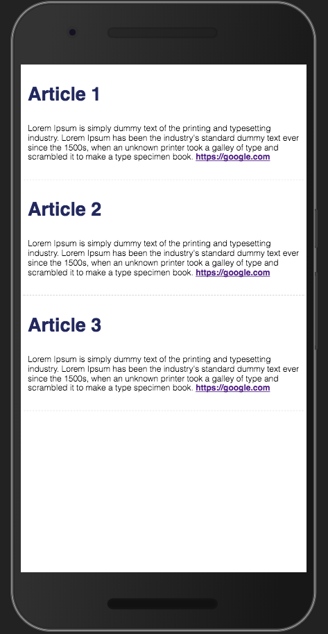

# chapter-two
Now that we have learnt how to build a component. we could start ***flooding our index file with components***, or we can learn how to better structure our components using modules. Along with learning how to structure our components, we will be learning how to write our styles as modules, a common practice when working with react.

## Structuring Our Components
To structure our components we will create a folder called Components. Inside that, we will create a folder specific to each component. the folder will then contain an `index.jsx` (where the definition of the react component) and a `styles.css` (where our styles specific to this component will live). The structure should look like this.

```
source/
  |- Component/
    |- Article/
      |- index.jsx
      |- styles.css
  |- index.jsx

```

## Modular JS
React components are designed to be used just like any standard export in javascript.

how to export a component:

```js
// source/Component/HelloWorld/index.jsx
export default function HelloWorld() {
  return (
    <div>Hello World</div>
  );
}

```
how to import a component from another file and use it:
```js
// source/index.jsx
import React from "react";
import ReactDom from "react-dom";

import HelloWorld from "./Component/HelloWorld";

ReactDom.render(
  <HelloWorld />,
  document.getElementById('root'),
);

```

## Exercise
Lets try and refactor `Article` out of `source/index.js` and into `source/Component/Article/index.jsx`

## Modular Styles
So far we have made a pretty plain `Article` component. To make it look a little neater we will be adding some styles 💅. To do this we will be writing our css as modules. This is setup in the webpack configuration (webpack.config.js). However configuring webpack is out of the scope of this lesson. The way css modules works is you write plain old css and then import it into your component like you would with js. you can then access your class names as if they were members of the import.

```css
/**
 * source/Component/Article/styles.css
 */
.myClass {
  border: 0.125rem dashed red;
}

```
```js
// source/Component/Article/index.jsx
import styles from './styles.css';

// we can now set our components classes using our class
export default function Article(props) {
  return (
    <article className={styles.myClass}>
      ...rest of component definition
    </article>
  )
}

```

## Exercise
Build out a layout for the article component. the article should look something like this:


